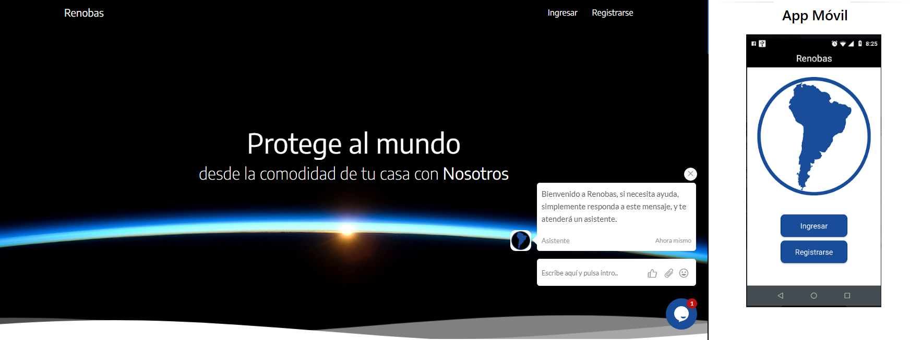
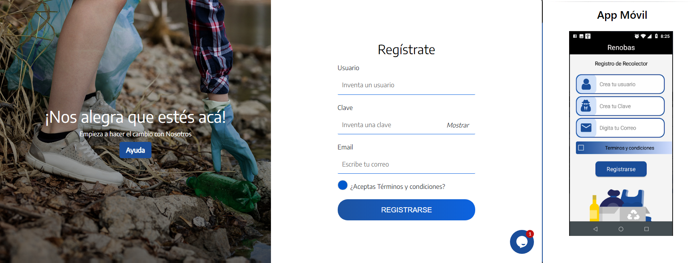
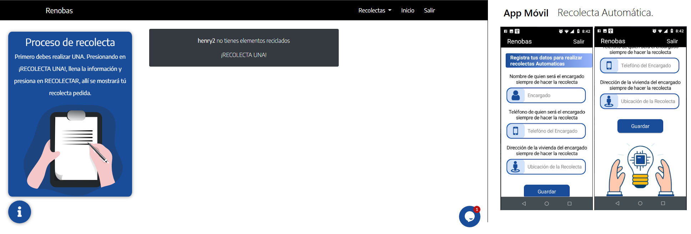
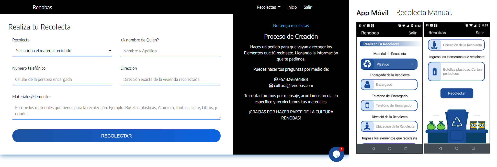
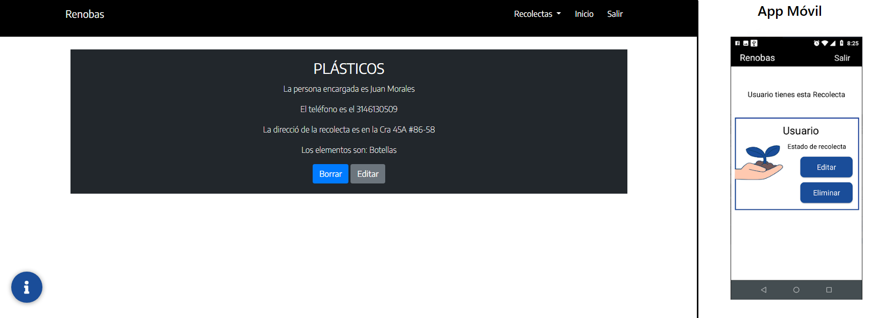

# Notas de recursos de Página web Renobas

Recurso de Código aplicación Web, llamada Renobas. 









### Instalación
```
mysql -u MYUSR "-pMYPASSWORD" < ./database/db.sql # create database
npm i
npm run build
npm start
```

## Estructura de archivos

- database, it the folder with all the sql queries, you can use to recreate the database for this application
- src, it's all the code for the Backend and Frontend Application
- docs

## Environment Variables

- PORT

## Versiones de Renobas

- [version-2021]

## Todo los recursos Usados

1. [x] Registro de usuarios en BD(Mysql)
1. [x] Componentes de Bootstrap
1. [x] Componentes de sweetalert2 
1. [x] Funcionalidades con Jquery y Javascript
1. [ ] Vista de Imagenes (Perfiles, Materiales)
1. [x] Responsive
1. [x] Links WhatsApp, Instagram, Twitter, Correo Corporativo
1. [x] Sesiones
1. [x] Imagenes SVG


## Herramientas

- Nodejs
- Mysql
- Babel
- Docker
